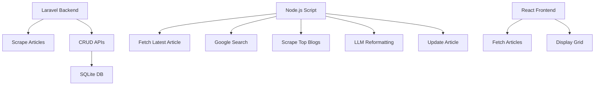

# BeyondChats Assignment

A full-stack application for scraping, processing, and displaying articles using Laravel, Node.js, and React.

**Tech Stack:** Laravel (Backend), Node.js (Processing), React (Frontend), SQLite (DB).

## Setup Instructions

### Backend

```bash
cd backend
composer install
php artisan migrate
php artisan serve
```

### NodeJS Processing

```bash
cd nodejs
npm install
node src/index.js
```

### Frontend

```bash
cd frontend
npm install
npm run dev
```

## Environment Variables

Create `.env` files in `backend/`, `nodejs/`, and `frontend/` (if needed).

### Backend (.env)

```
APP_KEY=your_app_key
DB_DATABASE=database/database.sqlite
```

### NodeJS (.env)

```
GOOGLE_API_KEY=your_google_api_key
GOOGLE_SEARCH_ENGINE_ID=your_search_engine_id
OPENAI_API_KEY=your_openai_api_key
LARAVEL_API_URL=http://localhost:8000/api
```

## Architecture Diagram / Data Flow



## Live Demo Link

[Frontend Demo](https://beyondchats-assignment-xi.vercel.app)

## Notes / Next Steps

- Add authentication for APIs.
- Implement caching for articles.
- Add monitoring/logging.
- Rate limiting for scraping.
- Queue system for Node.js processing.
