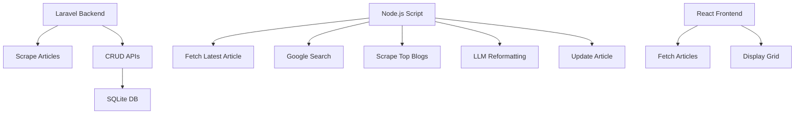

# BeyondChats Assignment

A full-stack application for scraping, processing, and displaying articles using Laravel, Node.js, and React.

## Problem Statement

BeyondChats required a system to:
- Scrape existing blog articles
- Store and manage them via APIs
- Analyze top-ranking articles from Google
- Enhance content using LLMs
- Display original and updated articles in a modern UI

This project demonstrates how such a system can be designed and implemented under time constraints.

**Tech Stack:** Laravel (Backend), Node.js (Processing), React (Frontend), SQLite (DB).

## Setup Instructions

### Backend:

```bash
cd backend
composer install
php artisan migrate
php artisan serve
```

### NodeJS Processing

```bash
cd nodejs
npm install
node src/index.js
```

### Frontend

```bash
cd frontend
npm install
npm run dev
```

## Environment Variables

Create `.env` files in `backend/`, `nodejs/`, and `frontend/` (if needed).

### Backend (.env)

```
APP_KEY=your_app_key
DB_DATABASE=database/database.sqlite
```

### NodeJS (.env)

```
GOOGLE_API_KEY=your_google_api_key
GOOGLE_SEARCH_ENGINE_ID=your_search_engine_id
OPENAI_API_KEY=your_openai_api_key
LARAVEL_API_URL=http://localhost:8000/api
```

## Architecture Diagram / Data Flow



## API Endpoints (Laravel)

 (GET)  -   /api/articles --> List all articles 
 (GET)  -   /api/articles/{id} --> Fetch single article 
 (POST) -   /api/articles --> Create article 
 (PUT)  -   /api/articles/{id} --> Update article 
 (DELETE)-  /api/articles/{id} --> Delete article 


## Live Demo Link

[Frontend Demo] --> (https://beyondchats-assignment-xi.vercel.app)
[Backend Demo] --> (https://beyondchats-assignment-wy3e.onrender.com/)

## Notes / Next Steps

- Add authentication for APIs.
- Implement caching for articles.
- Add monitoring/logging.
- Rate limiting for scraping.
- Queue system for Node.js processing.
